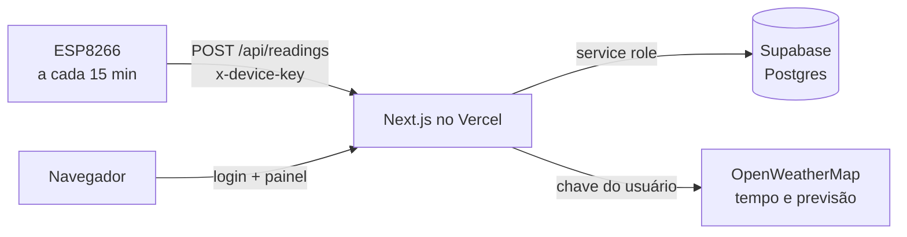

# Estação meteorológica: painel web

Painel web para acompanhar uma ou mais estações meteorológicas com **ESP8266**. Os ESPs enviam temperatura, umidade, sinal Wi-Fi e bateria por uma API REST; o painel guarda tudo no banco, mostra o histórico em gráficos e compara com o **tempo atual e a previsão** da cidade pela OpenWeatherMap.

Feito com **Next.js** (hospedado no **Vercel**) e **Supabase** (Postgres).

## Recursos

**Painel**
- Tempo atual da cidade em destaque (temperatura, sensação, umidade, vento, pressão, nascer e pôr do sol), com fundo de dia ou de noite conforme o ícone da OpenWeatherMap.
- Previsão dos próximos 4 dias: máxima, mínima, descrição, ícone e chance de chuva.
- Leituras do sensor do ESP: temperatura e umidade (com casa decimal), sinal Wi-Fi em % e dBm, e bateria.
- Bateria com ícone estilo celular, percentual, tensão em volts, estado **ativa** ou **inativa** (bateria detectada ou não) e aviso de bateria baixa.
- Status **online/offline** de cada ESP e tempo desde a última leitura.
- Gráfico de temperatura e umidade do ESP selecionado, com período de **24 horas, 7 dias ou 30 dias**.
- Seleção de **dispositivo** e de **cidade**: cada leitura guarda a cidade (código da OpenWeatherMap), e o gráfico e o tempo seguem a cidade escolhida.
- Informações do dispositivo: ID, IP, firmware, cidade e horário da última leitura.
- **Tema claro e escuro**, com o botão no topo (lembra a escolha e, na primeira visita, segue o tema do sistema).
- Layout responsivo para celular.

**Dispositivos**
- Cadastro de ESPs pelo ID, com nome e descrição.
- **Cadastro automático**: se um ESP envia uma leitura com um ID novo, ele é criado sozinho, com nome e descrição em branco, e o admin completa depois.
- Quem tem acesso a um ESP pode editar nome e descrição; só o admin cadastra e exclui.

**Usuários e permissões**
- Login com usuário e senha (senha com hash `scrypt`, sessão em cookie `httpOnly` de 7 dias).
- Dois tipos de usuário:
  - **Admin**: vê todos os ESPs e gerencia usuários.
  - **Normal**: vê só os ESPs que um admin liberou para ele.
- O admin escolhe, na criação ou depois, **quais ESPs cada usuário normal pode acessar**.
- **Chave da OpenWeatherMap por usuário**, cadastrada em *Minha conta* (ou pelo admin). A consulta ao tempo é feita no servidor, e a chave nunca vai para o navegador.
- **Usuário principal** (`ADMIN_USER` do ambiente): sempre admin, não pode ser excluído nem rebaixado, e a senha é a `ADMIN_PASSWORD`. Serve de acesso de emergência.
- Troca de senha pelo próprio usuário.

## Como funciona



O navegador e o ESP nunca falam direto com o banco: todo acesso passa pela API, que guarda as chaves.

## Tecnologias

Next.js 15 (App Router), React 19, TypeScript, Recharts, Supabase (`@supabase/supabase-js`), `jose` (JWT da sessão) e a API da OpenWeatherMap.

## Estrutura

```
app/
  page.tsx                 painel (tempo, previsão, sensor, gráfico)
  devices/page.tsx         dispositivos
  users/page.tsx           usuários e acesso (admin)
  account/page.tsx         minha conta (chave OpenWeatherMap, senha)
  login/page.tsx           login
  api/
    login, logout, me     sessão e dados do usuário logado
    users, users/[id]     gestão de usuários (admin)
    devices, devices/[id] gestão de dispositivos
    readings              ESP envia (POST) e painel consulta (GET)
    cities                cidades já enviadas por um ESP
    weather, forecast     tempo atual e previsão (OpenWeatherMap)
components/                TopBar, ThemeToggle, Battery
lib/                       auth (JWT), password (scrypt), session, supabase, format
esp8266/WeatherApi.h       exemplo de envio para o firmware do ESP
schema.sql                 banco novo
migration.sql              atualização de um banco existente
middleware.ts              protege páginas e API (exceto login e POST de leituras)
```

## Instalação

### 1. Supabase

1. Crie um projeto em [supabase.com](https://supabase.com).
2. No **SQL Editor**, rode `schema.sql` (banco novo) ou `migration.sql` (banco da versão anterior, mantém os dados).
3. Em **Project Settings → API**, copie a **URL do projeto**. Em **API Keys**, copie a chave secreta (`sb_secret_...`) ou, na aba *Legacy API Keys*, a `service_role`.

### 2. Vercel

1. Suba este repositório para o GitHub e importe em [vercel.com](https://vercel.com) (**Add New → Project**). O preset deve ser Next.js.
2. Em **Settings → Environment Variables**, crie as variáveis abaixo e faça o deploy (ou um *Redeploy*, pois variáveis só valem para deploys novos).

| Variável | Para que serve |
|---|---|
| `SUPABASE_URL` | URL do projeto Supabase |
| `SUPABASE_SERVICE_ROLE_KEY` | Chave de servidor do Supabase (nunca use o prefixo `NEXT_PUBLIC_`) |
| `DEVICE_KEY` | Senha longa que o ESP envia no cabeçalho `x-device-key` |
| `ADMIN_USER` | Usuário principal (sempre admin) |
| `ADMIN_PASSWORD` | Senha do usuário principal |
| `AUTH_SECRET` | Segredo para assinar a sessão (`openssl rand -base64 32`) |

O arquivo `.env.example` tem um modelo. Nunca envie o `.env` real para o GitHub.

### 3. Primeiro acesso

1. Abra o endereço do Vercel e entre com `ADMIN_USER` e `ADMIN_PASSWORD`.
2. Em **Minha conta**, cadastre sua chave da [OpenWeatherMap](https://openweathermap.org/api). Chaves novas podem levar um tempo para ativar.
3. Em **Usuários**, crie os demais usuários e marque os ESPs de cada um.
4. Os ESPs aparecem em **Dispositivos** no primeiro envio, ou você os cadastra pelo ID.

### Desenvolvimento local

```bash
cp .env.example .env.local   # preencha os valores
npm install
npm run dev                  # http://localhost:3000
```

## Firmware do ESP8266

O ESP faz um `POST` HTTPS a cada **15 minutos**. O arquivo `esp8266/WeatherApi.h` é um exemplo pronto: configure `API_URL`, `DEVICE_KEY`, `DEVICE_ID`, `CITY_ID` e `CITY_NAME`, e chame `sendReading(temperatura, umidade)`.

- O `DEVICE_ID` é a identidade do ESP no painel. Cada ESP precisa de um ID próprio.
- O `CITY_ID` é o código da cidade na OpenWeatherMap (por exemplo, Franca = `3463011`).
- A umidade e a temperatura são enviadas com uma casa decimal (por exemplo, com um sensor DHT22).
- **Bateria**: o exemplo lê a tensão no pino `A0`. Uma LiPo chega a 4,2 V, mais do que o `A0` aguenta, então use um divisor de tensão externo e ajuste `BATTERY_DIVIDER` (calibre com um multímetro). Se a leitura fica abaixo de 2,5 V, o ESP envia `battery_active: false` (bateria inativa).
- O exemplo usa `setInsecure()` no TLS por simplicidade, porque o ESP8266 tem pouca memória para validar certificados.

## API

### Enviar leitura (ESP)

`POST /api/readings`, com o cabeçalho `x-device-key: <DEVICE_KEY>` e `Content-Type: application/json`.

```json
{
  "device_id": "esp8266-sala",
  "temperature": 24.5,
  "humidity": 61.3,
  "city_id": 3463011,
  "city_name": "Franca",
  "ip": "192.168.0.50",
  "rssi": -62,
  "firmware": "1.0",
  "battery": 83,
  "battery_voltage": 4.02,
  "battery_active": true
}
```

| Campo | Obrigatório | Descrição |
|---|---|---|
| `device_id` | sim | ID do ESP (texto, até 64 caracteres) |
| `temperature` | sim | Temperatura em °C (número) |
| `humidity` | sim | Umidade em % (número) |
| `city_id` | não | Código da cidade na OpenWeatherMap |
| `city_name` | não | Nome da cidade |
| `ip`, `rssi`, `firmware` | não | Dados do dispositivo (rssi em dBm) |
| `battery` | não | Carga em % |
| `battery_voltage` | não | Tensão da bateria em V |
| `battery_active` | não | `true` se há bateria detectada |

Respostas: `200 {"ok":true}`, `400 invalid payload`, `401 unauthorized` (chave errada) e `500 db error`.

Teste rápido:

```bash
curl -X POST https://SEU-PROJETO.vercel.app/api/readings \
  -H "Content-Type: application/json" -H "x-device-key: SUA_DEVICE_KEY" \
  -d '{"device_id":"esp8266-sala","temperature":24.5,"humidity":61.3,"city_id":3463011,"city_name":"Franca"}'
```

### Demais rotas (exigem login)

| Rota | Quem | Função |
|---|---|---|
| `GET /api/readings?device=ID&hours=24&city=CODIGO` | com acesso ao ESP | Leituras do período (até 720 horas); `city` é opcional |
| `GET /api/cities?device=ID` | com acesso ao ESP | Cidades já enviadas pelo ESP |
| `GET /api/weather?city=CODIGO` | logado | Tempo atual, com a chave do usuário |
| `GET /api/forecast?city=CODIGO` | logado | Previsão dos próximos 4 dias |
| `GET /api/devices` | logado | Lista os ESPs visíveis ao usuário |
| `POST /api/devices` | admin | Cadastra ESP |
| `PATCH /api/devices/[id]` | com acesso ao ESP | Edita nome e descrição |
| `DELETE /api/devices/[id]` | admin | Exclui ESP e suas leituras |
| `GET/POST /api/users` | admin | Lista e cria usuários |
| `PATCH/DELETE /api/users/[id]` | admin | Edita (tipo, chave, senha, ESPs liberados) ou exclui |
| `GET/PATCH /api/me` | logado | Dados do usuário; troca chave e senha |
| `POST /api/login`, `POST /api/logout` | público, logado | Sessão |

## Banco de dados

| Tabela | Conteúdo |
|---|---|
| `users` | Usuários, hash da senha, tipo (`admin` ou `user`) e chave da OpenWeatherMap |
| `devices` | ESPs: nome, descrição, IP, Wi-Fi, bateria, firmware, cidade e última leitura |
| `user_devices` | Quais ESPs cada usuário normal pode ver |
| `readings` | Histórico de temperatura, umidade e cidade |
| `device_cities` | Cidades já usadas por cada ESP (alimenta o seletor) |

As tabelas têm RLS ligado e nenhuma policy: só a API, com a chave de servidor, acessa os dados.

## Segurança e limites

- A chave do Supabase e a da OpenWeatherMap ficam só no servidor.
- Existe uma única `DEVICE_KEY` para todos os ESPs. Quem a tiver consegue enviar leituras e criar dispositivos, então guarde-a e troque-a se vazar.
- As chaves da OpenWeatherMap ficam gravadas em texto no banco e não são mostradas de volta na interface.
- Não há limitação de tentativas de login: use uma senha forte no `ADMIN_PASSWORD`.
- A previsão usa o plano gratuito da OpenWeatherMap (até 5 dias, em blocos de 3 horas).

## Solução de problemas

| Sintoma | Causa provável |
|---|---|
| `404 DEPLOYMENT_NOT_FOUND` | Endereço errado ou deploy que falhou: confira em **Deployments** no Vercel |
| `400 invalid payload` | Corpo vazio ou sem `device_id`, `temperature` e `humidity` (números) |
| `401 unauthorized` na API do ESP | `x-device-key` diferente de `DEVICE_KEY` |
| `500 db error` | Variáveis do Supabase erradas, falta de *Redeploy* ou `schema.sql` / `migration.sql` não executado |
| "A OpenWeatherMap recusou a chave" | Chave errada, ou nova demais e ainda não ativada |
| ESP aparece offline | Sem leitura há mais de 40 minutos (o envio é a cada 15) |
| Usuário normal não vê nenhum ESP | Um admin precisa liberar os ESPs em **Usuários** |
| Gráfico sem dados | Nenhuma leitura no período, ou a cidade selecionada não tem leituras |
